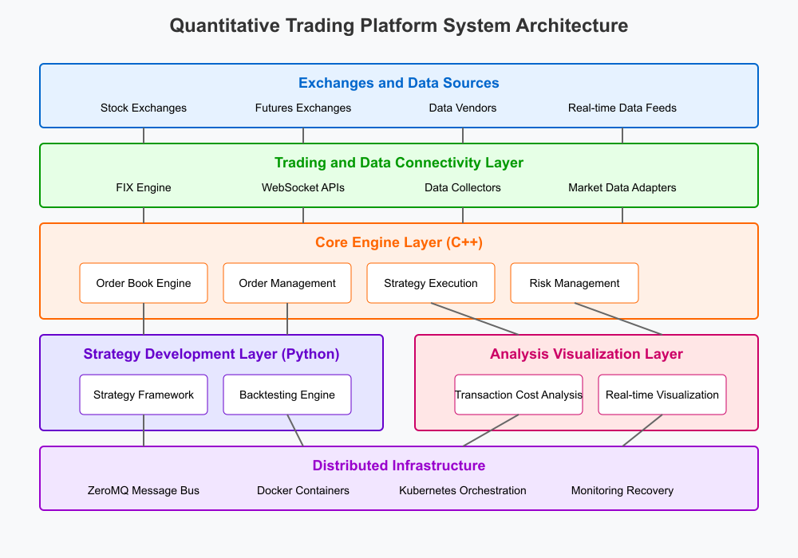

# TradeMind: An Algorithmic Trading Framework

TradeMind is a high-performance, professional-grade quantitative trading platform designed for algorithmic trading, with a focus on low-latency execution, advanced strategy development, and real-time market microstructure visualization analysis.

## System Architecture



The platform consists of five key layers:

1. **Exchanges and Data Sources Layer**
   - Connects to stock and futures exchanges
   - Integrates with data vendors and real-time feeds
   - Provides raw market data for processing

2. **Trading and Data Connectivity Layer**
   - FIX Engine for low-latency exchange communication
   - WebSocket APIs for modern connectivity
   - Data collectors and market data adapters

3. **Core Engine Layer (C++)**
   - High-performance order book engine
   - Sophisticated order management system
   - Strategy execution engine
   - Real-time risk management

4. **Strategy Development Layer (Python)**
   - Flexible strategy framework for algorithm development
   - Comprehensive backtesting engine for strategy evaluation

5. **Analysis & Visualization Layer**
   - Transaction cost analysis to optimize trading performance
   - Real-time visualization of market data and system metrics

All these components are supported by a robust **Distributed Infrastructure** layer that includes:
   - ZeroMQ message bus for low-latency inter-component communication
   - Docker containerization for deployment flexibility
   - Kubernetes orchestration for scaling and management
   - Comprehensive monitoring and automatic recovery systems

## Key Features

- **High-Performance Core Engine**: C++ implementation of critical components ensures microsecond-level response time
- **Real-time Market Microstructure Analysis**: Capture and analyze order book dynamics and liquidity metrics
- **Flexible Strategy Development**: Python API for rapid strategy development using machine learning and quantitative models
- **Comprehensive Backtesting**: Event-driven backtesting engine with realistic market simulation
- **Low-Latency Order Execution**: FIX protocol integration for direct exchange connectivity
- **Distributed Architecture**: Microservices design with ZeroMQ messaging for horizontal scalability
- **Cloud-Ready Deployment**: Containerized services that can be deployed in cloud environments

## Getting Started

### Prerequisites

- C++17 compatible compiler (GCC 7+, Clang 5+, MSVC 2019+)
- CMake 3.15+
- Python 3.8+
- ZeroMQ 4.3+
- Boost 1.70+
- Fix8 (for FIX protocol support)
- YAML-CPP

### Building from Source

1. Clone the repository:
   ```bash
   git clone https://github.com/jialuechen/trademind.git
   cd trademind
   ```

2. Build the C++ components:
   ```bash
   mkdir build && cd build
   cmake ..
   make -j$(nproc)
   ```

3. Install the Python package:
   ```bash
   cd python
   pip install -e .
   ```

### Configuration

Edit the configuration files in the `config` directory to set up:

- Exchange connections
- Market data sources
- Risk parameters
- Logging preferences
- Performance settings

Example configuration is provided in `config/config.yaml`.

### Running the Platform

To start the platform with default settings:

```bash
./bin/trademind
```

To specify a custom configuration file:

```bash
./bin/trademind --config /path/to/custom_config.yaml
```

## Strategy Development

TradeMind provides a powerful Python API for developing trading strategies. Here's a minimal example:

```python
from pyquant import Strategy, Context, OrderSide, OrderType

class SmaStrategy(Strategy):
    def initialize(self) -> None:
        # Set strategy parameters
        self.parameters = {
            "symbol": "AAPL",
            "fast_period": 10,
            "slow_period": 30,
            "trade_size": 100
        }
        
        # Add symbols to trade
        self.context.symbols = [self.parameters["symbol"]]
        
    def on_bar(self, context: Context, bar_dict) -> None:
        symbol = self.parameters["symbol"]
        bars = bar_dict[symbol]
        
        # Calculate moving averages
        fast_ma = bars['close'].rolling(self.parameters["fast_period"]).mean()
        slow_ma = bars['close'].rolling(self.parameters["slow_period"]).mean()
        
        # Get current position
        position = context.get_position(symbol)
        
        # Trading logic: Buy when fast MA crosses above slow MA
        if fast_ma.iloc[-2] <= slow_ma.iloc[-2] and fast_ma.iloc[-1] > slow_ma.iloc[-1]:
            if position.quantity <= 0:
                self.buy(symbol, self.parameters["trade_size"])
                
        # Sell when fast MA crosses below slow MA
        elif fast_ma.iloc[-2] >= slow_ma.iloc[-2] and fast_ma.iloc[-1] < slow_ma.iloc[-1]:
            if position.quantity >= 0:
                self.sell(symbol, self.parameters["trade_size"])
```

## Backtesting

To backtest a strategy:

```python
from pyquant import BacktestEngine, BacktestVisualizer, Timeframe
import pandas as pd

# Load historical data
data = pd.read_csv("data/AAPL_daily.csv", index_col='date', parse_dates=True)

# Create and configure strategy
strategy = SmaStrategy()

# Set up backtest engine
backtest = BacktestEngine()
backtest.add_strategy(strategy)
backtest.add_bar_data("AAPL", Timeframe.D1, data)

# Run backtest
results = backtest.run(
    start_time=data.index[100],
    end_time=data.index[-1],
    initial_capital=100000.0
)

# Visualize results
visualizer = BacktestVisualizer()
visualizer.generate_report(results)
```

## Parameter Optimization

TradeMind includes tools for strategy parameter optimization:

```python
from pyquant import StrategyOptimizer

# Create optimizer
optimizer = StrategyOptimizer(SmaStrategy)
optimizer.add_bar_data("AAPL", Timeframe.D1, data)

# Define parameter grid
param_grid = {
    "fast_period": [5, 10, 15, 20],
    "slow_period": [20, 30, 40, 50],
}

# Run grid search
best_params = optimizer.grid_search(
    param_grid=param_grid,
    start_time=data.index[100],
    end_time=data.index[-1],
    optimize_metric='sharpe_ratio'
)

print(f"Best parameters: {best_params}")
```

## Distributed Deployment

For production environments, TradeMind can be deployed as a distributed system using Docker and Kubernetes:

```bash
cd docker
docker-compose up -d
```

For Kubernetes deployment:

```bash
kubectl apply -f kubernetes/trademind.yaml
```

## Contributing

Contributions are welcome! Please check out our [contributing guidelines](CONTRIBUTING.md) for details on how to submit pull requests, report issues, or suggest improvements.

## License

This project is licensed under the Apache License 2.0 - see the [LICENSE](LICENSE) file for details.
